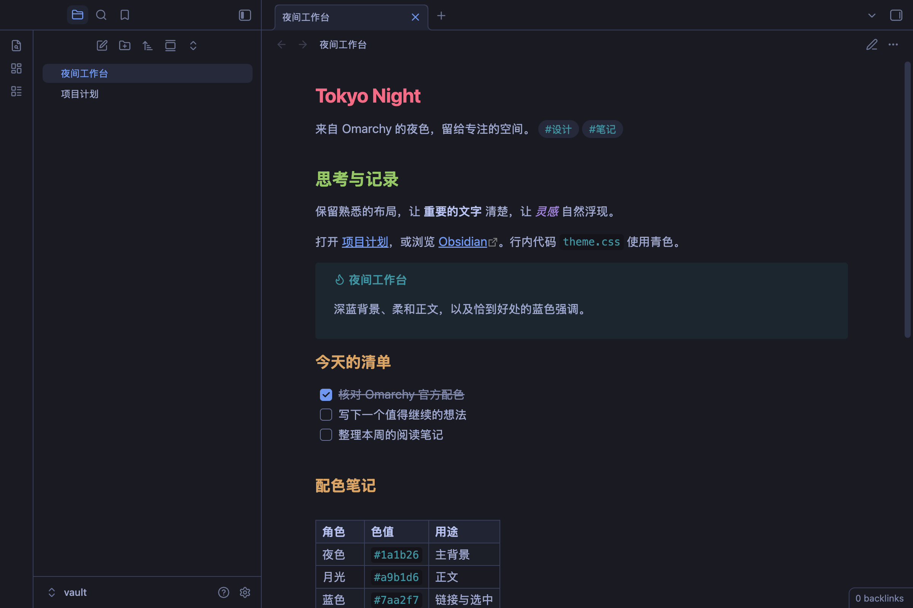
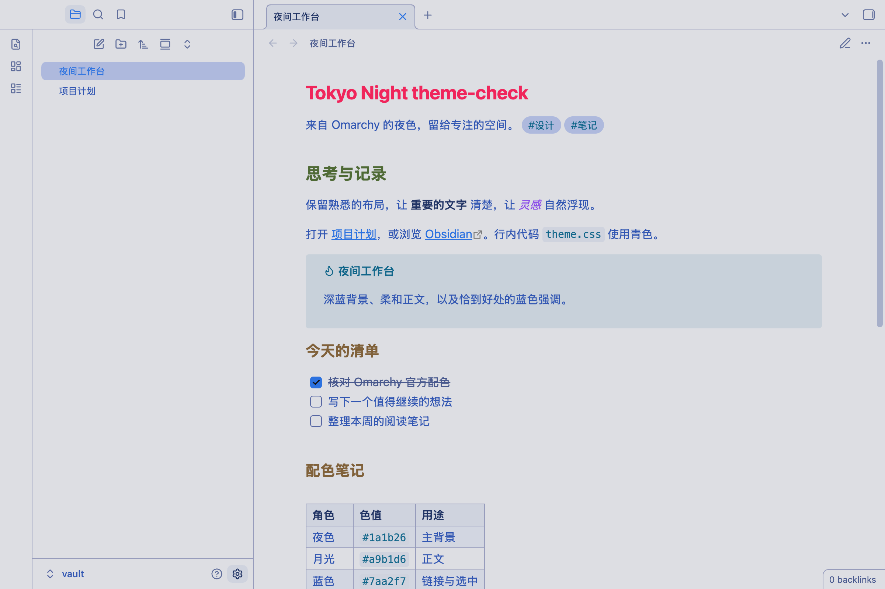

# Omarchy Tokyo Night

把 Omarchy 的 Tokyo Night 深色与社区 Tokyo Day 浅色配色带到 Obsidian。独立 CSS 主题，无需安装 Omarchy、插件或字体，离线可用。

## 预览

### Tokyo Night · 深色

### Tokyo Day · 浅色

## 安装

1. 将本目录复制到知识库的 `.obsidian/themes/Omarchy Tokyo Night/`，确保 `manifest.json` 和 `theme.css` 直接位于该目录下。
2. 在 Obsidian「设置 → 外观」中选择主题 **Omarchy Tokyo Night**。
3. 在「基础颜色」中选择「浅色」「深色」或「跟随系统」，同一个主题会自动使用对应配色。若主题列表未刷新，重启 Obsidian。

只想安装必要文件时，复制 `manifest.json`、`theme.css` 和 `LICENSE` 即可。卸载时先切换回默认主题，再删除主题目录。

## 配色与范围

主背景 `#1a1b26`、正文 `#a9b1d6`、强调色 `#7aa2f7` 均来自 Omarchy 的 Tokyo Night 色板。标题依次使用红、绿、黄、蓝、紫、紫，与官方 Obsidian 模板一致。

保留 Obsidian 原生布局和用户字体设置，补齐标签页、侧栏、表格、任务、链接、代码高亮与图谱的语义颜色。为保证小字可读性，次要文字和代码注释比官方模板更亮；代码块使用色板中的深色背景。文字选区使用 Tokyo Night 的 `selection` 色。它不是官方发布，也不会模拟 Linux 的系统窗口边框或壁纸。

浅色模式采用社区 Tokyo Day：背景 `#e1e2e7`、正文 `#3760bf`、强调色 `#2e7de9`、选区 `#b7c1e3`。边框、控件背景和次要文字按界面用途适配；深浅两种模式都覆盖上述组件。其他 CSS 片段、第三方插件和用户强调色设置可能覆盖主题效果。移动端沿用原生响应式布局，尚未做实体移动端验证。

## 来源

- [Omarchy Tokyo Night 色板](https://github.com/omacom/omarchy/blob/quattro/themes/tokyo-night/colors.toml)
- [社区 Tokyo Day 色板（Kayle Gishen）](https://github.com/kayleg/omarchy-tokyo-day/blob/main/colors.toml)
- [Tokyo Night Day 上游（Folke Lemaitre）](https://github.com/folke/tokyonight.nvim)
- [Omarchy Obsidian 模板](https://github.com/omacom/omarchy/blob/quattro/default/themed/obsidian.css.tpl)

参考日期：2026-09-26。遵循 MIT 许可，详见 LICENSE。

## 验证

已在 macOS 的 Obsidian 1.14.2 隔离测试库中验证主题加载、核心色值、阅读模式、实时预览、文字输入和独立设置窗口，以及通过外观设置往返切换浅色／深色，并核对截图。未验证移动端和第三方插件。
